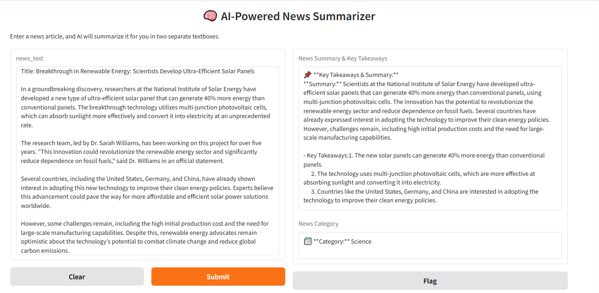

# 📰 AI-Powered News Summarizer

This project is an **AI-powered news summarization tool** that takes a news article as input and generates a **concise summary with key takeaways and category classification** using the **Groq API**.

## 🚀 Features
- 📌 **Summarizes long news articles into short, easy-to-read summaries**
- 📌 **Classifies news into categories (Politics, Sports, Business, etc.)**
- 📌 **Uses Groq API for accurate and fast text summarization**
- 📌 **User-friendly UI built with Gradio**

---

## 🖥️ Screenshots & Demo

Here’s how the app looks when running:

)

**Live Demo:** [Try It Here](https://f7e17a82c3958cae38.gradio.live/)


## 📂 Project Structure

---

## 🛠️ **Setup Guide**
### 1️⃣ Install Visual Studio Code (VS Code)
First, download and install **VS Code** from the official website: [VS Code Download](https://code.visualstudio.com/).


### **Step 1: Clone the Repository**
```bash
git clone https://github.com/your-repo/ai_news_summarizer.git
cd ai_news_summarizer
```
### ** Step 2: Install Pipenv (If Not Installed) ** 
```
pip install pipenv
```

### **Step 3: Create and Activate a Virtual Environment**

### For Windows:
```

pipenv install
pipenv install Groq
pipenv shell


```
### **Step 4: Install Dependencies**
```
pip install gradio requests python-dotenv groq
```


### **Step 5: Set Up Your API Key**
**Create a .env file inside the project folder. **
** Add your Groq API key ** 
```
GROQ_API_KEY=your_groq_api_key_here
```
### ** Step 6: Run the App **
python gradio_app.py


### ** Code Implementation **
** Summariser.py**
```
import os
import groq
from dotenv import load_dotenv

# Load environment variables
load_dotenv()

# Groq API Key
GROQ_API_KEY = os.getenv("GROQ_API_KEY")

# Initialize Groq Client
client = groq.Client(api_key=GROQ_API_KEY)

def summarize_text(text):
    """
    Summarizes a given news article text using Groq API.

    Args:
        text (str): The full news article text.

    Returns:
        dict: A dictionary containing key takeaways, a summary, and a category.
    """

    prompt = f"""
    Read the following news article and perform the following tasks:
    
    1. **Summarize the article in 3-5 concise sentences.**
    2. **Extract the key takeaways in bullet points.**
    3. **Classify the news into a category from the following list:**
       - Politics, Business, Sports, Science, Technology, Health, Entertainment, Environment, or World News.

    **Article:**
    {text}

    **Format the response exactly like this:**
    - Summary: [Your summary here]
    - Key Takeaways: 
      1. [Takeaway 1]
      2. [Takeaway 2]
      3. [Takeaway 3]
    - Category: [One of Politics, Business, Sports, Science, Technology, Health, Entertainment, Environment, World News]
    """

    try:
        response = client.chat.completions.create(
            model="llama3-8b-8192",
            messages=[{"role": "user", "content": prompt}]
        )

        response_text = response.choices[0].message.content

        # Extract summary, key takeaways, and category
        summary = response_text.split("- Summary: ")[1].split("- Key Takeaways:")[0].strip()
        key_takeaways = "- Key Takeaways:" + response_text.split("- Key Takeaways:")[1].split("- Category:")[0].strip()
        category = response_text.split("- Category:")[1].strip()

        return {
            "category": category, 
            "summary": f"**Summary:** {summary}\n\n{key_takeaways}"
        }

    except Exception as e:
        return {"error": f"Failed to fetch summary: {str(e)}"}

```
** gradio_app.py**
```
import gradio as gr
from summariser import summarize_text

def generate_summary(news_text):
    """
    Gradio wrapper for summarizing news text.
    
    Args:
        news_text (str): Full news article text.
        
    Returns:
        tuple: (summary, category) displayed in two separate textboxes.
    """
    result = summarize_text(news_text)
    
    if "error" in result:
        return result["error"], "Error"

    summary_text = f"📌 **Key Takeaways & Summary:**\n{result['summary']}"
    category_text = f"📰 **Category:** {result['category']}"

    return summary_text, category_text

# Gradio UI with two separate output textboxes
interface = gr.Interface(
    fn=generate_summary,
    inputs=gr.Textbox(lines=10, placeholder="Paste news article text here..."),
    outputs=[
        gr.Textbox(label="News Summary & Key Takeaways", lines=10), 
        gr.Textbox(label="News Category", lines=2)
    ],
    title="🧠 AI-Powered News Summarizer",
    description="Enter a news article, and AI will summarize it for you in two separate textboxes."
)

# Run Gradio app
if __name__ == "__main__":
    interface.launch()

```

## 📦 How It Works
1. **Paste a news article** into the input box.
2. **Click Submit** to generate a summarized version.
3. The AI will provide:
   - 📌 **A short summary** of the article.
   - 📌 **Key takeaways** from the news.
   - 📌 **Category classification** (e.g., Politics, Science, Technology).

Link for running the Application
```
https://f7e17a82c3958cae38.gradio.live/
```
